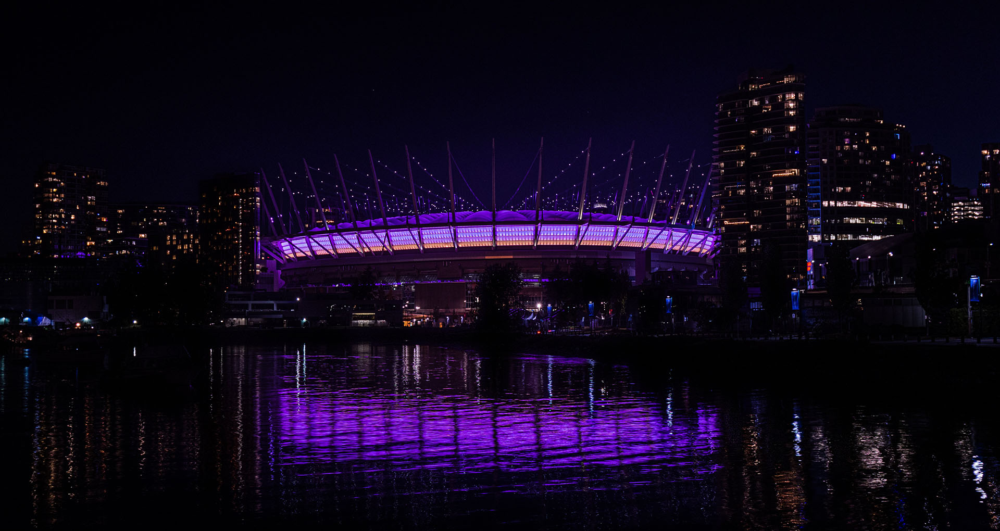

# Match day arrivals

Crew members at BC Place Vancouver set the tone for a calm arrival. Keep instructions short, visible, and consistent with the signs at each decision point.

## Before gates open

1. Check in with your zone lead and confirm your gate, break time, and radio channel.
2. Walk the queue lanes and remove anything that blocks the accessible route.
3. Confirm the nearest washrooms, water refill point, first aid room, and family reunification desk.

## Guest flow

- Direct ticket holders to the next open scanner before the queue backs up.
- Keep families and groups together unless security asks for a separate screening lane.
- Use the accessible lane for guests with mobility needs, sensory support requests, strollers, or service animals.

> If a guest is upset, lower the pace of the conversation first. Call your lead only after you have the guest away from the moving queue.
